# Helper Scripts Agent Architecture

## System Overview

The helper-scripts system is a **self-organizing agent ecosystem** for managing Python scripts in the `scripts/` directory. It follows a discovery-first architecture that prioritizes code reuse, self-documentation, and continuous quality management.

## Architecture Diagram

```mermaid
graph TB
    %% Style definitions
    classDef primary fill:#e1f5e1,stroke:#4caf50,stroke-width:3px,color:#1b5e20
    classDef secondary fill:#e3f2fd,stroke:#2196f3,stroke-width:2px,color:#0d47a1
    classDef tertiary fill:#f3e5f5,stroke:#9c27b0,stroke-width:2px,color:#4a148c
    classDef action fill:#fff3e0,stroke:#ff9800,stroke-width:2px,color:#e65100
    classDef output fill:#fce4ec,stroke:#e91e63,stroke-width:2px,color:#880e4f
    classDef trigger fill:#e0f2f1,stroke:#009688,stroke-width:2px,color:#004d40

    %% Main entry point
    Entry[/"User Request or<br/>Automated Trigger"/]:::trigger

    %% Discovery Agent - Primary Agent
    Discover["🔍 discover-helper-scripts<br/>Primary Agent<br/>(Teal)"]:::primary
    
    %% Supporting Agents
    Create["✨ create-helper-script<br/>Script Creator<br/>(Green)"]:::secondary
    Index["📚 index-helper-scripts<br/>Documentation Generator<br/>(Purple)"]:::tertiary
    Analyse["🔬 analyse-helper-scripts<br/>Tech Debt Analyzer<br/>(Purple)"]:::tertiary

    %% Files and Artifacts
    IndexFile[("scripts/INDEX.md<br/>Token-optimized catalog<br/>~5K tokens")]:::output
    TodoFile[("scripts/TODO.md<br/>Tech debt catalog<br/>Priority: High/Med/Low")]:::output
    Scripts[("scripts/*.py<br/>Helper Scripts<br/>PEP-723 format")]:::output
    ClaudeMD[("scripts/CLAUDE.md<br/>Coding Guidelines")]:::output

    %% Decision points
    IndexExists{INDEX.md<br/>exists?}
    NeedScript{Script<br/>exists?}
    HasDebt{High priority<br/>debt?}

    %% Actions
    ReadIndex[["Read INDEX.md<br/>Load script catalog"]]:::action
    RunHelp[["Run --help<br/>Extract descriptions"]]:::action
    ScanImports[["Scan imports<br/>Find env deps"]]:::action
    CreateScript[["Create/Update<br/>Helper script"]]:::action
    RefactorRec[["Recommend:<br/>/j:refactor-helper-scripts"]]:::action
    RefactorCmd[["Execute:<br/>/j:refactor-helper-scripts [N]<br/>Implements tech debt"]]:::action

    %% Flow connections
    Entry --> Discover
    Discover --> IndexExists
    
    IndexExists -->|No| Index
    IndexExists -->|Yes| ReadIndex
    
    ReadIndex --> NeedScript
    NeedScript -->|No| Create
    NeedScript -->|Yes| Scripts
    
    Index --> RunHelp
    RunHelp --> ScanImports
    ScanImports --> IndexFile
    
    Create --> CreateScript
    CreateScript --> Scripts
    Scripts --> Index
    Scripts --> Analyse
    
    Analyse --> TodoFile
    TodoFile --> HasDebt
    HasDebt -->|Yes| RefactorRec
    RefactorRec --> RefactorCmd
    RefactorCmd --> Create
    HasDebt -->|No| Discover
    
    IndexFile --> ReadIndex
    ClaudeMD -.->|Guidelines| Create
    ClaudeMD -.->|Standards| Analyse

    %% Annotations
    subgraph "Proactive Triggers"
        T1["After script creation"]
        T2["After script update"]
        T3["On missing INDEX.md"]
    end
    
    T1 -.->|Triggers| Index
    T1 -.->|Triggers| Analyse
    T2 -.->|Triggers| Index
    T2 -.->|Triggers| Analyse
    T3 -.->|Triggers| Index

    %% Agent Capabilities Box
    subgraph "Agent Capabilities"
        direction LR
        Cap1["🔍 Discover: Script reuse & discovery"]
        Cap2["✨ Create: Script generation"]
        Cap3["📚 Index: Documentation"]
        Cap4["🔬 Analyse: Tech debt"]
    end
```

## Key Architectural Components

### 🔍 **Discovery-First Architecture**
- **Primary Agent**: `discover-helper-scripts` acts as the orchestrator
- **Principle**: Reuse existing scripts before creating new ones
- **Prevents**: One-off `python -c` commands that lose context

### 📚 **Self-Documenting System**
- **Index Agent**: Maintains token-optimized `INDEX.md` (~5K tokens, 60% reduction)
- **Automation**: Runs `--help` on scripts to extract descriptions
- **Format**: Compressed tables and command patterns for efficient context loading

### 🔬 **Continuous Quality Management**
- **Analysis Agent**: Monitors technical debt in `TODO.md`
- **Priority System**: High/Medium/Low with line-level references
- **Recommendation Engine**: Triggers `/j:refactor-helper-scripts` when needed
- **Refactor Command**: `/j:refactor-helper-scripts [N]` implements top N tech debt items

### ✨ **Intelligent Script Creation**
- **Create Agent**: Handles CREATE/UPDATE/REFACTOR operations
- **Standards**: Follows `scripts/CLAUDE.md` guidelines
- **Validation**: Uses `mcp__ide__getDiagnostics` instead of runtime testing

### 🔄 **Proactive Maintenance Loop**
1. Script creation/update triggers indexing
2. Indexing triggers analysis
3. Analysis may recommend refactoring
4. `/j:refactor-helper-scripts` command implements tech debt fixes
5. Refactored scripts trigger re-indexing and re-analysis
6. Discovery prevents duplicate functionality

## Agent Interactions

| Agent | Triggers | Produces | Consumes |
|-------|----------|----------|----------|
| discover-helper-scripts | User requests, Missing functionality | Script selection or creation request | INDEX.md |
| create-helper-script | Discovery agent, User CREATE/UPDATE, /j:refactor-helper-scripts | Python scripts | CLAUDE.md guidelines, TODO.md items |
| index-helper-scripts | Script creation/update, Missing INDEX.md | INDEX.md (token-optimized) | Script --help output |
| analyse-helper-scripts | Script creation/update | TODO.md, Refactor recommendations | Python scripts, CLAUDE.md |
| /j:refactor-helper-scripts | User command, Analyse agent recommendation | Tech debt implementation requests | TODO.md priorities |

## Design Principles

1. **Token Efficiency**: Optimize for minimal context window usage
2. **Code Reuse**: Prefer existing scripts over new creation
3. **Maintainable Automation**: Self-organizing with human oversight
4. **Proactive Maintenance**: Automatic indexing and analysis
5. **Quality Gates**: Tech debt tracking with actionable recommendations

## File Artifacts

- **scripts/INDEX.md**: Token-optimized script catalog (~5K tokens)
- **scripts/TODO.md**: Prioritized technical debt catalog
- **scripts/CLAUDE.md**: Coding guidelines and standards
- **scripts/*.py**: PEP-723 formatted helper scripts with --help support

This architecture optimizes for **token efficiency**, **code reuse**, and **maintainable automation** while keeping human oversight through the recommendation system.